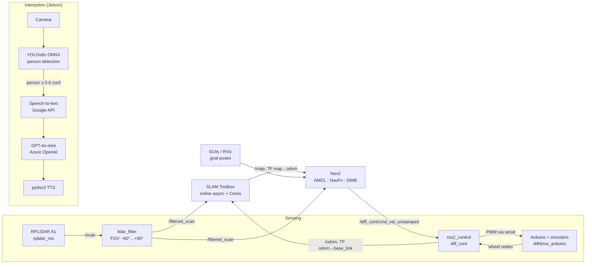
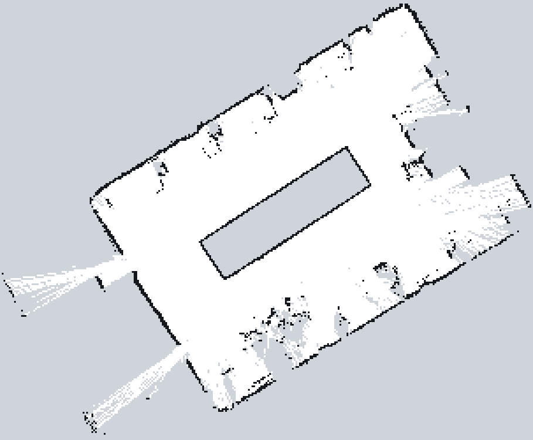
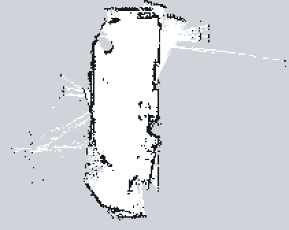

# Autonomous SLAM-Based Interactive Robot

**An open, reproducible indoor service robot with LiDAR SLAM, Nav2 navigation, and LLM-driven voice interaction**

[](https://docs.ros.org/en/humble/)
[](https://releases.ubuntu.com/22.04/)
[](LICENSE)

Khadeeja Khan · Hassaan Muhammad Khan · Narmeen Sabah Siddiqui · Abdul Rafey Beig<br>
Supervisor: Commodore Dr Attaullah Y. Memon<br>
Pakistan Navy Engineering College, National University of Sciences and Technology (NUST), Pakistan, Spring 2025

📄 [Full report (PDF)](Report+Presentation/Autonomous_SLAM_Navigation_Delivery_Robot.pdf) · 📊 [Slides (PPTX)](Report+Presentation/Autonomous_SLAM_Navigation_Delivery_Robot.pptx) · 🎬 [Project video](Assets/FYP_DisplayVideo.mp4) · 🎥 [Simulation video](<Assets/ros simulation_compressed.mp4>) · 🛠️ [Mechanical CAD](<Assets/mechanical design.rar>)

### Project Video

https://github.com/user-attachments/assets/0864337d-0213-44a8-b935-acf943a1f0ec

<p align="center"><em>Project introduction video, shown at the final year project presentation.</em></p>

<div align="center">
  
  &nbsp;&nbsp;
  
</div>

---

## Abstract

Indoor environments such as offices, schools, and hospitals increasingly need robots that can move around on their own and interact with people. Existing solutions often have limited reach, rely on predefined paths, or offer little user interaction. We present a low-cost, general-purpose mobile assistant robot for GPS-denied indoor spaces.

- **Mapping and localization:** 2D LiDAR SLAM (SLAM Toolbox with pose-graph optimization by Ceres Solver).
- **Navigation:** ROS 2 Nav2 with AMCL localization, a Dijkstra global planner, and a DWB local controller.
- **Interaction:** an edge pipeline that detects a person with YOLOv8 (ONNX Runtime), transcribes their speech, answers with a large language model (GPT-4o-mini via Azure OpenAI), and replies through text-to-speech. A display shows an animated face.

Multithreading raised person-detection throughput on an embedded GPU from ~1.5 FPS to 9–10 FPS. Spoken responses arrived within 1.5–2 s. The SLAM pipeline stayed under 60% average CPU on a Raspberry Pi 4B, with pose-graph optimization latency below 200 ms.

This repository contains the full software stack, robot description, tuned parameters, recorded maps, and step-by-step instructions to reproduce the system in simulation and on hardware.

---

## Contents

1. [System Overview](#1-system-overview)
2. [Repository Structure](#2-repository-structure)
3. [Reproducibility: Tested Environment](#3-reproducibility-tested-environment)
4. [Installation](#4-installation)
5. [Experiment A: Simulation (Gazebo)](#5-experiment-a-simulation-gazebo)
6. [Experiment B: Real-Robot Bring-up](#6-experiment-b-real-robot-bring-up)
7. [Experiment C: Mapping with SLAM Toolbox](#7-experiment-c-mapping-with-slam-toolbox)
8. [Experiment D: Localization and Autonomous Navigation](#8-experiment-d-localization-and-autonomous-navigation)
9. [Experiment E: Human-Robot Interaction](#9-experiment-e-human-robot-interaction)
10. [Provided Maps (Data)](#10-provided-maps-data)
11. [Key Parameters](#11-key-parameters)
12. [Results](#12-results)
13. [Known Issues and Deviations from the Report](#13-known-issues-and-deviations-from-the-report)
14. [Citation](#14-citation)
15. [Acknowledgements](#15-acknowledgements)

---

## 1. System Overview

### 1.1 Hardware

| Subsystem | Component | Role |
|---|---|---|
| Robot computer | Raspberry Pi 4B (4 GB)\* | ROS 2 master: SLAM, Nav2, control |
| AI computer | NVIDIA Jetson Nano\* | Person detection, speech, LLM client |
| Microcontroller | Arduino Uno | Encoder counting, motor PWM, PID (serial, 57600 baud) |
| LiDAR | Slamtec RPLIDAR A1 | 360° 2D scans at 5–10 Hz, ≤12 m range |
| Drive | 2 × 12 V DC gear motors (90:1) with quadrature encoders, AQMH2407ND driver | Differential drive + caster |
| Interaction | 7" display, USB microphone, USB speaker, Logitech Brio camera | Face animation, voice I/O, vision |
| Power | 12 V Li-ion pack + buck converters | |
| Chassis | Laser-cut plywood, rack style, 50 × 40 × 105 cm, ~5 kg, ≤3 kg payload | |

\* Configuration described in the report. The ROS 2 workspace in this repository was last run on an **NVIDIA Jetson Orin Nano** (Ubuntu 22.04, JetPack 6 / L4T R36.4). See [§3](#3-reproducibility-tested-environment).

<div align="center">
  
  <br><em>Figure 1. Hardware connections.</em>
</div>

### 1.2 Software Pipeline



<div align="center">
  
  <br><em>Figure 2. Software and ROS 2 architecture.</em>
</div>

---

## 2. Repository Structure

```
.
├── Software Stack/
│   ├── ros2_ws/                      # ROS 2 Humble workspace (SLAM + navigation)
│   │   ├── src/
│   │   │   ├── my_bot/               # Robot description, launch files, SLAM/Nav2/ros2_control configs
│   │   │   ├── lidar_filter/         # LiDAR field-of-view filter node (/scan → /filtered_scan)
│   │   │   ├── lidar_fov_filter_pkg/ # Earlier version of the FOV filter
│   │   │   ├── delivery_robot_gui/   # PyQt5 location-picker GUI
│   │   │   ├── mygui/                # PyQt5 Nav2 goal GUI (standalone script)
│   │   │   ├── qt_gui_ros2/          # RViz embedded in a Qt app (third-party, credited)
│   │   │   ├── diffdrive_arduino/    # submodule: ros2_control hardware interface for Arduino
│   │   │   ├── serial/               # submodule: serial library
│   │   │   └── serial_motor_demo/    # submodule: motor test GUI/driver
│   │   ├── eyes.py                   # Animated face for the 7" display
│   │   ├── run_all.sh                # One-shot launcher (LiDAR + filter + SLAM + Nav2)
│   │   └── *.pgm / *.yaml / *.posegraph / *.data   # Recorded maps (see §10)
│   ├── Facial-Emotion-Recognition/   # Person detection + voice assistant (Jetson)
│   └── viam-slam/                    # Earlier Viam-based prototype (see VIAM_SETUP.md)
├── Assets/                           # Figures, videos, CAD
├── Report+Presentation/              # Final report and slides
└── LICENSE
```

---

## 3. Reproducibility: Tested Environment

The following environment was used to build and test this repository. Using the same versions gives the closest reproduction.

| Item | Version |
|---|---|
| OS | Ubuntu 22.04.5 LTS (aarch64) |
| Platform | NVIDIA Jetson Orin Nano Developer Kit, L4T R36.4.4 |
| ROS 2 | Humble Hawksbill |
| `slam_toolbox` | 2.6.10 |
| `navigation2` / `nav2_bringup` | 1.1.18 |
| `ros2_control` / `ros2_controllers` | 2.51.0 / 2.47.0 |
| `rplidar_ros` | 2.1.4 |
| `ros_gz` (Gazebo Fortress bridge) | 0.244.20 |
| `ign_ros2_control` | 0.7.15 |
| `twist_mux` | 4.3.0 |
| Python | 3.10 |

**Verification status** (checked on 2026-10-06 on the platform above):

| Check | Status |
|---|---|
| `colcon build` of all 9 packages | ✅ passes (warnings from third-party packages only) |
| URDF (`check_urdf`) | ✅ valid |
| All `my_bot` launch files load (`--show-args`) | ✅ |
| Gazebo: robot spawns, `diff_cont` + `joint_broad` controllers active, `/scan` ≈ 9 Hz | ✅ (headless) |
| SLAM, Nav2, and interaction on hardware | Reported in the thesis (§12); not re-run for this release |

> Without hardware, you can run Experiments A, C, and D entirely in simulation on any Ubuntu 22.04 machine with ROS 2 Humble. A desktop with a GPU is recommended for Gazebo.

---

## 4. Installation

### Step 1: Install ROS 2 Humble

Follow the official guide: <https://docs.ros.org/en/humble/Installation/Ubuntu-Install-Debs.html> (choose `ros-humble-desktop`).

### Step 2: Install system dependencies

```bash
sudo apt update && sudo apt install -y \
  python3-colcon-common-extensions python3-rosdep git \
  ros-humble-xacro ros-humble-robot-state-publisher ros-humble-joint-state-publisher \
  ros-humble-ros2-control ros-humble-ros2-controllers ros-humble-controller-manager \
  ros-humble-slam-toolbox ros-humble-navigation2 ros-humble-nav2-bringup \
  ros-humble-rplidar-ros ros-humble-twist-mux ros-humble-teleop-twist-keyboard \
  ros-humble-ros-gz ros-humble-ign-ros2-control \
  ros-humble-tf-transformations ros-humble-rviz2 \
  libserial-dev qtbase5-dev python3-pyqt5
```

### Step 3: Clone the repository *with submodules*

```bash
git clone --recursive https://github.com/Hassaanmk/Autonomous-SLAM-Based-Interactive-robot.git
cd Autonomous-SLAM-Based-Interactive-robot
```

> Already cloned without `--recursive`? Run `git submodule update --init --recursive`.

### Step 4: Resolve remaining dependencies and build

```bash
cd "Software Stack/ros2_ws"
source /opt/ros/humble/setup.bash
sudo rosdep init 2>/dev/null; rosdep update
rosdep install --from-paths src --ignore-src -r -y
colcon build --symlink-install
```

Expected result: `Summary: 9 packages finished`.

### Step 5: Source the workspace

Run this in **every new terminal**, from `Software Stack/ros2_ws`:

```bash
source /opt/ros/humble/setup.bash
source install/setup.bash
```

All commands below assume this has been done and that the current directory is `Software Stack/ros2_ws`.

---

## 5. Experiment A: Simulation (Gazebo)

Use this to validate the stack without hardware. The simulated robot uses the same URDF, controllers, and LiDAR model as the real one.

**Terminal 1: launch Gazebo with the robot**

```bash
ros2 launch my_bot launch_sim.launch.py
# or with obstacles:
ros2 launch my_bot launch_sim.launch.py world:=$(ros2 pkg prefix my_bot)/share/my_bot/worlds/obstacles.world
```

Check: `ros2 control list_controllers` shows `diff_cont` and `joint_broad` as **active**.

**Terminal 2: FOV filter** (SLAM and Nav2 use `/filtered_scan`)

```bash
ros2 launch my_bot lidar_fov_filter.launch.py
```

**Terminal 3: drive the robot**

```bash
ros2 run teleop_twist_keyboard teleop_twist_keyboard --ros-args -r /cmd_vel:=/diff_cont/cmd_vel_unstamped
```

**Terminal 4: visualize**

```bash
rviz2 -d src/my_bot/config/view_bot.rviz
```

From here, continue with [Experiment C](#7-experiment-c-mapping-with-slam-toolbox) and [Experiment D](#8-experiment-d-localization-and-autonomous-navigation), adding `use_sim_time:=true` to every command.

---

## 6. Experiment B: Real-Robot Bring-up

### Step 1: Flash the Arduino

`diffdrive_arduino` talks to the Arduino using the **ROSArduinoBridge** serial protocol.

1. Get the firmware from <https://github.com/joshnewans/ros_arduino_bridge>.
2. Set the pins for your motor driver and encoders.
3. Upload it from the Arduino IDE. The baud rate must be **57600**.

Test it from the Arduino serial monitor:
- `e` should print the two encoder counts.
- `m 20 20` should spin both wheels.

### Step 2: Identify serial ports

```bash
ls -l /dev/serial/by-path/   # stable names for each USB port
ls /dev/ttyACM* /dev/ttyUSB*
```

Update the two device paths if yours differ:

| Device | File | Parameter | Value in repo |
|---|---|---|---|
| Arduino | `src/my_bot/description/ros2_control.xacro` | `device` | `/dev/ttyACM0` |
| RPLIDAR | `src/my_bot/launch/rplidar.launch.py` | `serial_port` | `/dev/serial/by-path/platform-3610000.usb-usb-0:2.3:1.0-port0` (Jetson Orin USB) |

Add your user to the `dialout` group once (`sudo usermod -aG dialout $USER`, then log out and back in), and rebuild after editing (`colcon build --symlink-install`).

### Step 3: Launch the base, LiDAR, and filter

```bash
# Terminal 1: robot_state_publisher + ros2_control (Arduino hardware)
ros2 launch my_bot launch_robot.launch.py

# Terminal 2: LiDAR driver → /scan
ros2 launch my_bot rplidar.launch.py

# Terminal 3: FOV filter → /filtered_scan
ros2 launch my_bot lidar_fov_filter.launch.py
```

**Checks:**

```bash
ros2 control list_controllers          # diff_cont, joint_broad: active
ros2 topic hz /filtered_scan           # ~5–10 Hz
ros2 run teleop_twist_keyboard teleop_twist_keyboard --ros-args -r /cmd_vel:=/diff_cont/cmd_vel_unstamped
```

> **Remote visualization:** run RViz on a laptop on the same network with the same `ROS_DOMAIN_ID`; SSH into the robot for the launch commands.

---

## 7. Experiment C: Mapping with SLAM Toolbox

The SLAM configuration (`src/my_bot/config/mapper_params_online_async.yaml`) is stored in **localization** mode. For mapping, override the mode on the command line:

```bash
ros2 run slam_toolbox async_slam_toolbox_node --ros-args \
  --params-file src/my_bot/config/mapper_params_online_async.yaml \
  -p mode:=mapping -p use_sim_time:=false
```

Then drive slowly through the whole environment with teleop (see §6, Step 3). Close loops by returning to places you've already mapped. In RViz, add a **Map** display on `/map`.

**Save the map** (both formats):

```bash
# Occupancy grid for AMCL / map_server  →  my_map.pgm + my_map.yaml
ros2 run nav2_map_server map_saver_cli -f my_map

# Pose graph for SLAM Toolbox localization / continued mapping  →  my_map.posegraph + my_map.data
ros2 service call /slam_toolbox/serialize_map slam_toolbox/srv/SerializePoseGraph "{filename: '$PWD/my_map'}"
```

---

## 8. Experiment D: Localization and Autonomous Navigation

This reproduces the navigation experiment from the report. Localization uses **AMCL** on a saved map, global planning uses **NavFn (Dijkstra)**, and local control uses **DWB**.

With the robot running (§6, Step 3) or the simulation running (§5), open two more terminals:

```bash
# Terminal A: map_server + AMCL on a saved map (absolute path required)
ros2 launch my_bot localization_launch.py map:=$PWD/fyplab_save.yaml use_sim_time:=false

# Terminal B: Nav2 planners, controller, behaviours
ros2 launch my_bot navigation_launch.py use_sim_time:=false
```

In RViz:
1. Set **Fixed Frame** to `map`.
2. Click **2D Pose Estimate** and mark the robot's real position and heading on the map.
3. Click **Nav2 Goal** to send a goal. The robot plans a path and drives there, avoiding obstacles via the local costmap.

<details>
<summary>Alternative: SLAM Toolbox localization on a serialized pose graph</summary>

```bash
ros2 run slam_toolbox async_slam_toolbox_node --ros-args \
  --params-file src/my_bot/config/mapper_params_online_async.yaml \
  -p mode:=localization -p map_file_name:=$PWD/fyplab_serialize3 -p use_sim_time:=false
```

Use this *instead of* Terminal A (`map_file_name` takes the path without the extension). Then launch Terminal B as above.

</details>

**Goal-sending GUIs:**

```bash
python3 src/mygui/nav_gui.py               # buttons that send NavigateToPose goals
ros2 run delivery_robot_gui delivery_robot_gui
ros2 run qt_gui_ros2 main                  # RViz embedded in a Qt window
```

The goal coordinates are hard-coded in each GUI and are specific to the map used during testing. Edit them for your map; read positions from RViz with **Publish Point**.

**One-shot launcher:** `run_all.sh` starts the LiDAR, filter, SLAM, and Nav2 in one go. Before using it, change the `source ~/ros2_ws/install/setup.bash` line to point to this workspace, and start `launch_robot.launch.py` separately.

---

## 9. Experiment E: Human-Robot Interaction

Runs on the AI computer (Jetson). The scripts are in `Software Stack/Facial-Emotion-Recognition`.

### Step 1: Python environment

```bash
cd "Software Stack/Facial-Emotion-Recognition"
python3 -m venv venv && source venv/bin/activate
sudo apt install -y portaudio19-dev espeak-ng      # microphone + TTS backends
pip install opencv-python numpy ultralytics onnxruntime SpeechRecognition PyAudio pyttsx3 sounddevice openai
```

> On Jetson, install NVIDIA's PyTorch wheel for your JetPack first, and `onnxruntime-gpu` if you want GPU inference.

### Step 2: LLM credentials

Create an Azure OpenAI resource with a **gpt-4o-mini** deployment. In the script you run, fill in the `endpoint`, `subscription_key`, and `api_version` variables in the *Azure OpenAI Configuration* block. **Never commit real keys.**

### Step 3: Run

| Script | Pipeline |
|---|---|
| `yolo_standby` | **Full system**: threaded YOLOv8 person detection → voice assistant with wake-word standby (`python3 yolo_standby`) |
| `onnx_azure.py` | Threaded detection → voice assistant (no standby) |
| `main_standby.py` | Voice assistant with standby only (no camera) |
| `chat_openai.py` | Minimal voice chat loop |
| `nano_detection.py` | Person detection only (exports `yolov8n.pt` → ONNX first) |
| `nano_main_threading.py` | Detection + Groq Llama chat (needs `groq` and a `GROQ_KEY`) |

The assistant starts when a person is detected with ≥ 0.8 confidence. Say a goodbye phrase to end or pause the session. Press `q` in the video window to stop detection.

**Face display** (on the 7" screen, 800 × 480):

```bash
pip install pygame
python3 "Software Stack/ros2_ws/eyes.py"
```

**Viam prototype:** the earlier Viam-based SLAM experiments are documented in [`Software Stack/viam-slam/VIAM_SETUP.md`](<Software Stack/viam-slam/VIAM_SETUP.md>).

---

## 10. Provided Maps (Data)

All maps are in `Software Stack/ros2_ws/` at 0.05 m/cell resolution. `.pgm`/`.yaml` files are occupancy grids for `map_server`/AMCL. `.posegraph`/`.data` files are serialized SLAM Toolbox graphs for localization or for continuing to map.

<div align="center">
  
  &nbsp;
  
  <br><em>Figure 3. Occupancy grids built with SLAM Toolbox on the robot: FYP Lab, NUST PNEC (<code>fyplab_save</code>, left; the central rectangle is the lab bench) and balcony (<code>balcony</code>, right). Black = occupied, white = free, grey = unexplored; 0.05 m per cell.</em>
</div>

| Map | Environment | Occupancy grid | Pose graph |
|---|---|---|---|
| `fyplab_save` | Final Year Project Lab, NUST PNEC (main test area) | ✅ | — |
| `fyplab_serialize`, `fyplab_serialize3`, `fyplab2_serialize`, `fyplab_v2` | Final Year Project Lab (successive runs) | — | ✅ |
| `balcony` | Balcony | ✅ | ✅ |
| `n_balcony` | Balcony (later run) | — | ✅ |
| `corridor_serialize` | Corridor | — | ✅ |
| `my_map_save` / `my_map_serial` | Final Year Project Lab (early run; shows odometry drift) | ✅ | ✅ |
| `narmyn_map` / `narmyn_map_serial` | Final Year Project Lab (early run; shows odometry drift) | ✅ | ✅ |

---

## 11. Key Parameters

Values below are taken from the configuration files in `src/my_bot/config/` and are the ones to use when reproducing results.

| Group | Parameter | Value |
|---|---|---|
| **SLAM Toolbox** | solver | Ceres, `SPARSE_NORMAL_CHOLESKY`, Levenberg–Marquardt |
| | resolution / max laser range | 0.05 m / 20 m |
| | `map_update_interval` | 5.0 s |
| | `minimum_travel_distance` / `heading` | 0.5 m / 0.5 rad |
| | loop closing | enabled |
| | scan topic | `/filtered_scan` |
| **FOV filter** | angular window | −90° … +90° |
| **AMCL** | particles | 500–2000, likelihood-field model, differential motion model |
| **Planner** | NavFn | Dijkstra (`use_astar: false`), tolerance 0.5 m |
| **Controller** | DWB | `max_vel_x` 0.26 m/s, `max_vel_theta` 1.0 rad/s |
| | goal tolerance | 0.25 m, 0.25 rad |
| **Costmaps** | robot radius / inflation radius | 0.22 m / 0.55 m |
| **Base** | wheel radius / separation | 0.033 m / 0.34 m |
| | encoder counts per wheel rev | 3046 |
| | wheel PID (Arduino) | P = 20, I = 0, D = 12, O = 50 |
| | control loop | `ros2_control` 50 Hz, hardware loop 30 Hz |

---

## 12. Results

Results as reported in the thesis (Chapters 4 and 7). Hardware experiments were run in an indoor lab of ~6 × 8 m on smooth tiled floor, with narrow passages, static obstacles (cones, boxes, chairs), and sharp turns.

| Metric | Result |
|---|---|
| SLAM average CPU usage (Raspberry Pi 4B) | < 60% |
| Pose-graph optimization latency (50 m² area) | < 200 ms |
| Map quality | Walls, corners, and narrow gaps captured with minimal drift; loop closures detected and corrected automatically |
| Navigation | Goals reached consistently with low positional error in cluttered layouts |
| Obstacle avoidance | Paths re-planned around newly introduced static obstacles without collisions |
| Person detection (Jetson Nano, YOLOv8n ONNX) | ~1.5 FPS single-threaded → **9–10 FPS** with threaded capture/inference |
| Voice response latency | 1.5–2 s |

**Engineering findings** (Chapter 8):
- **LiDAR field of view:** the LiDAR enclosure caused false obstacle detections. A software filter that keeps only the open angular window (`lidar_filter`) removed them without hardware changes.
- **Narrow spaces:** Nav2 halted in narrow passages until the footprint and inflation radius were re-tuned.
- **Simulation drift:** orientation drift in Gazebo after rotation was reduced by changing the wheel collision geometry from cylinders to spheres.

---

## 13. Known Issues and Deviations from the Report

Please read this before comparing your results with the report.

- **Wheel separation:** the controller uses `wheel_separation: 0.34` m, while the URDF places the wheels 0.48 m apart (`wheel_offset_y: 0.24`). Measure your robot and make the two agree, or odometry rotation will be scaled incorrectly.
- **SLAM parameters:** the report describes `map_update_interval = 2.0` s, the raw `/scan` topic, and 2 Ceres threads. The committed config uses 5.0 s and `/filtered_scan`, and doesn't set the thread count. The committed values are the most recent ones used on the robot.
- **Retrieval-Augmented Generation:** the Chroma-based RAG described in §4.4.4 of the report is **not included** in this repository. The scripts here call the LLM directly.
- **`delivery_robot_gui`** publishes to `move_base_simple/goal` (the ROS 1 topic) with placeholder coordinates. Nav2 listens on `/goal_pose`, so remap the topic (`--ros-args -r move_base_simple/goal:=/goal_pose`) and set real coordinates. `nav_gui.py` uses the Nav2 action and works as is.
- **Interaction scripts:** `nano_main_threading.py` has a Windows model path and uses a Groq model that has since been retired. In `onnx_azure-2`, the goodbye check is always true, so it exits after the first reply. `chat_openai.py`, `onnx_azure.py`, and `onnx_azure-2` don't catch LLM API errors, and they send error output to `/dev/null`, so a failure exits silently. To see errors, comment out the `sys.stderr = open(os.devnull, 'w')` line.
- **Bounding boxes** are drawn in 640 × 640 model coordinates on the original frame, so they look offset when the camera resolution differs.

---

## 14. Citation

If you use this work, please cite:

```bibtex
@techreport{khan2025autonomous,
  title       = {Autonomous SLAM-Based Navigation Bot with Object Avoidance, Human Interaction, and Real-Time User Integration},
  author      = {Khan, Khadeeja and Siddiqui, Narmeen Sabah and Khan, Hassaan Muhammad and Beig, Abdul Rafey},
  institution = {Pakistan Navy Engineering College, National University of Sciences and Technology},
  type        = {Final Year Design Project Report},
  address     = {Karachi, Pakistan},
  year        = {2025},
  note        = {Supervised by Cdre Dr Attaullah Y. Memon},
  url         = {https://github.com/Hassaanmk/Autonomous-SLAM-Based-Interactive-robot}
}
```

---

## 15. Acknowledgements

We thank our supervisor, **Commodore Dr Attaullah Y. Memon**, for the support and guidance given throughout the project.

This work builds on open-source software:
- [Articulated Robotics](https://articulatedrobotics.xyz/) by Josh Newans: the `my_bot` template, [`diffdrive_arduino`](https://github.com/joshnewans/diffdrive_arduino), [`serial`](https://github.com/joshnewans/serial), [`serial_motor_demo`](https://github.com/joshnewans/serial_motor_demo), and [`ros_arduino_bridge`](https://github.com/joshnewans/ros_arduino_bridge)
- [`qt_gui_ros2`](https://github.com/bandasaikrishna/qt_gui_ros2) by @bandasaikrishna
- [SLAM Toolbox](https://github.com/SteveMacenski/slam_toolbox), [Nav2](https://github.com/ros-navigation/navigation2), [Ultralytics YOLOv8](https://github.com/ultralytics/ultralytics), [ONNX Runtime](https://onnxruntime.ai/), and the [Viam OpenAI integration tutorial](https://github.com/viam-labs/tutorial-openai-integration)

## License

Released under the [MIT License](LICENSE). Third-party packages keep their original licences and authorship.
